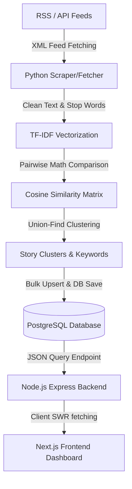
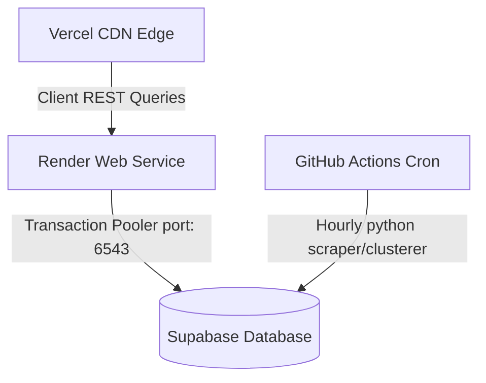

# News Pulse ⚡ - Real-time News Clustering & Editorial Dashboard

🔗 **Live Production Demo**: [https://news-pulse-orcin-pi.vercel.app/](https://news-pulse-orcin-pi.vercel.app/)

News Pulse is a highly polished, recruiter-ready production dashboard that fetches, normalizes, and groups real-time news articles from various RSS feeds into unified "story clusters" using custom machine learning clustering algorithms. It features a modern, responsive, and beautifully designed user interface designed to showcase complex data aggregates cleanly.

---

## 1. Project Overview

The objective of News Pulse is to solve the problem of information fragmentation. When major events unfold, multiple publishers report the same story from different angles. Instead of showing duplicate headlines, News Pulse clusters articles about the same story together, displaying them as a single cohesive card. The user can inspect the coverage depth (match strength, publisher dots, TF-IDF keyword tooltips) and open a Linear/Notion-style side drawer to review coverage from all reporting outlets.

---

## 2. Ingestion & Clustering Pipeline

The system processes real-time feeds sequentially in a highly decoupled, multi-tier architecture:

1. **RSS/API Sources**: The fetcher pulls articles from 10 high-volume sources (BBC, NPR, Reuters, Guardian, Al Jazeera).
2. **Python Fetcher**: Fetches, parses, normalizes, and hashes article content to prevent duplicates.
3. **TF-IDF Vectorization**: Fits a Term Frequency-Inverse Document Frequency vectorizer to analyze word importance across articles.
4. **Cosine Similarity**: Calculates pairwise similarity matrices representing the geometric proximity of articles.
5. **Story Clusters**: Employs Disjoint Set Union (Union-Find) algorithms to group articles above a specific threshold and extract top TF-IDF keyword features.
6. **Node.js Backend**: Exposes clean JSON API endpoints.
7. **Frontend Dashboard**: A Next.js visual interface with custom CSS styling, dynamic date filtering, search, animated statistics, and details drawers.

---

## 3. Tech Stack

- **Data Ingestion**: Python (Feedparser, Psycopg2, scikit-learn, NumPy)
- **Algorithms**: TF-IDF Vectorization, Pairwise Cosine Similarity, Disjoint Set Union (Union-Find)
- **Database**: PostgreSQL (pg pool, lateral joins, array fields)
- **Backend API**: Node.js, Express
- **Frontend App**: Next.js (App Router, SWR client caching, Lucide icons)
- **Styling**: Vanilla CSS custom design system (with layout transitions and responsive queries)

---

## 4. Clustering Algorithm Detail

1. **Vectorization (TF-IDF)**:
   - The combined text (title + summary) of all new articles is cleaned of URLs, publisher branding, and standard stop words.
   - Text is converted into numerical feature vectors where each word is weighted using TF-IDF:
     $$\text{TF-IDF}(t, d, D) = \text{TF}(t, d) \times \text{IDF}(t, D)$$
     This penalizes common words (like "said", "today") and rewards specific keywords (like "earthquake", "senate").

2. **Similarity Matrix (Cosine Similarity)**:
   - Measures the cosine of the angle between two multi-dimensional TF-IDF vectors:
     $$\text{similarity}(A, B) = \cos(\theta) = \frac{A \cdot B}{\|A\| \|B\|}$$
   - Returns a value between `0.0` (orthogonal/no word overlap) and `1.0` (identical).

3. **Connected Components Grouping**:
   - Compares all articles. If the cosine similarity between Article $i$ and Article $j$ exceeds the threshold (e.g. `0.08`), they are connected.
   - A Disjoint Set Union (DSU) algorithm aggregates these connections into partitioned sets representing individual story clusters.

4. **Labeling and Keyword Extraction**:
   - For each cluster, we compute the average TF-IDF feature weight across its constituent articles.
   - The top 3 features are concatenated as the uppercase cluster title, and the top 5 features are stored in the database as keywords.

---

## 5. Current Limitations

- **Semantic Similarity Gap**: TF-IDF relies on exact term overlaps. It misses semantic matches (e.g. grouping "automobile crash" with "car accident" if they don't share exact words).
- **Synonym Incompatibility**: Cannot associate synonyms unless they are close enough in document frequency or context.
- **Threshold Tuning**: A static cosine similarity threshold (e.g., `0.08`) can lead to cluster fragmentation if set too high, or near-unrelated news merging if set too low.
- **Duplicate handling**: Articles with minor changes are clustered, but strict deduplication on title/hash is required before vectorization.

---

## 6. Future Improvements

- **Sentence-Transformers**: Integrate BERT/SBERT embeddings to calculate semantic vectors instead of pure word overlap statistics.
- **FAISS (Facebook AI Similarity Search)**: Use FAISS or a vector database (e.g., pgvector) to scale vector search to millions of articles in sub-milliseconds.
- **Incremental Clustering**: Update clusters dynamically on a per-article ingestion hook instead of rebuilding the matrix from scratch.
- **Semantic Search**: Enable natural language semantic querying across all clusters.
- **Real-Time Streaming**: Stream updates directly using WebSockets or Server-Sent Events (SSE).

---

## 7. System Architecture & Deployment ("What Runs Where & Why")

News Pulse is deployed using a modern, decoupled cloud architecture designed for high availability, low operating costs, and clean separation of concerns:

1. **Frontend (Vercel)**:
   - **What**: Next.js App Router static/dynamic client dashboard.
   - **Why**: Hosted on Vercel for fast global edge CDN distribution, automatic SSL, and seamless serverless routing. It connects to the Render API via `NEXT_PUBLIC_API_URL`.

2. **Backend API (Render)**:
   - **What**: Node.js Express API.
   - **Why**: Runs on Render to handle persistent JSON API requests, manage CORS, and serve database queries. It connects to Supabase via its Transaction Connection Pooler to optimize resource usage on serverless connections.

3. **Automated Scraping Pipeline (GitHub Actions)**:
   - **What**: Python 3.11 feed ingestion, TF-IDF vectorization, and connected-component clustering.
   - **Why**: Executed as a serverless cron job every hour. By offloading heavy mathematical clustering (`scikit-learn`, `numpy`, `scipy`) from Render's Node.js free containers to GitHub's hosted runners, we keep the main API fast, lightweight, and completely free of memory-exhaustion crashes.

4. **Database (Supabase / PostgreSQL)**:
   - **What**: Relational PostgreSQL database.
   - **Why**: Supabase provides an enterprise-ready PostgreSQL instance with native support for arrays, lateral joins, and transaction connection pooling (via PgBouncer on port `6543`), ensuring secure and fast concurrent queries.

